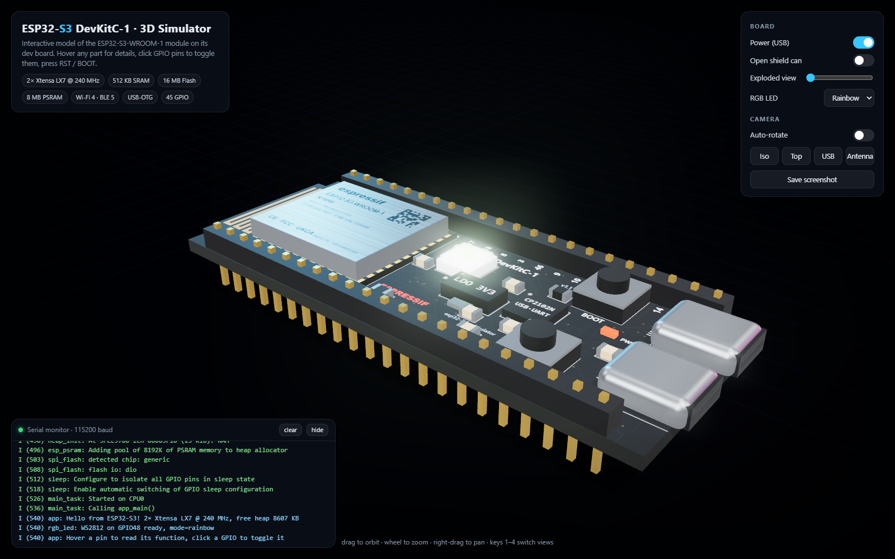

# esp32-3d — ESP32-S3 DevKitC-1 3D Simulator

An interactive, browser-based 3D model of the **ESP32-S3-WROOM-1** module sitting on
an ESP32-S3-DevKitC-1 development board. Everything is modelled procedurally with
[three.js](https://threejs.org/); there are no binary assets to download.



## Run it

The whole simulator is a single file, `index.html`. three.js is pulled from the unpkg CDN,
so an internet connection is needed the first time.

```sh
# option 1: just open it
start index.html          # Windows
open index.html           # macOS

# option 2: serve it (recommended; avoids file:// quirks in some browsers)
npx serve .
# then open http://localhost:3000
```

## What you can do

| Interaction | Result |
|---|---|
| Drag / wheel / right-drag | Orbit, zoom, pan (OrbitControls) |
| Hover a part | Tooltip with the real component's role: pins, module, USB ports, LDO, LEDs… |
| Hover a header pin | GPIO number plus its alternate functions (ADC, TOUCH, SPI, JTAG, USB, strapping) |
| Click a GPIO pin | Toggles it HIGH / LOW, lights it up and logs to the serial monitor |
| Click RST / BOOT (or keys `R` / `B`) | Button press animation; RST reboots the chip, BOOT logs GPIO0 low |
| Power switch | Cuts or restores USB power. Boot replays a realistic ESP-IDF boot log |
| Open shield can | Lifts the metal RF can to reveal the ESP32-S3 die, 16 MB flash, 8 MB PSRAM and crystal |
| Exploded view slider | Lifts every component off the PCB by a different amount |
| RGB LED mode | Rainbow / breathe / off for the WS2812 on GPIO48 (with bloom) |
| Camera presets (`1`–`4`) | Iso, top-down, USB end, antenna end |
| Save screenshot | Downloads the current frame as PNG |

## Rendering details

- Physically based materials with an HDR room environment for reflections on the shield can, USB shells and gold pins.
- Silkscreen, module antenna, chip markings and the can's laser print are drawn to canvas textures at 48 px/mm.
- MSAA render target, ACES tone mapping and Unreal bloom so the LEDs actually glow.
- Soft shadow-mapped key light plus cyan / magenta rim lights, vignette and fog.

## Layout accuracy

Board size (63 × 25.5 mm), 2 × 22 header pins at 2.54 mm pitch, module footprint,
pin labels and GPIO function notes follow the ESP32-S3-DevKitC-1 v1.1 with an
ESP32-S3-WROOM-1-N16R8 module. Component placement between the headers is approximate
and intended to look right, not to be a CAD reference.

## Files

- `index.html` — the entire simulator (markup, styles, three.js scene, simulated firmware/serial log).

## Also in this repo: `lora/` — ESP32 LoRa Node bench simulator

A second, modular simulator of a custom 4-layer ESP32-WROOM-32 + SX1276 (RFM95W) LoRa PCB under
test on a workbench, with an oscilloscope, lab PSU, LiPo pack and USB-C. It adds LoRa PHY maths
(time-on-air, data rate, range vs. spreading factor), RF propagation domes, an auto-ranging thermal
camera overlay, status LEDs and live trace glow. It must be served over HTTP:

```sh
npx serve .
# open http://localhost:3000/lora/
```

See [lora/README.md](lora/README.md) for controls and the file map.

## Also in this repo: `lora2/` — ESP32 LoRa network · communication flow explorer

An interactive map of an ESP32 + SX1276 network: battery sensors, solar mesh repeaters and a Wi-Fi gateway to MQTT.
Follow one report step by step through firmware, SPI, CAD, chirps on air, mesh relays, the gateway, Wi-Fi/MQTT and the
ACK back, with a byte-level frame inspector and an airtime timeline that shows collisions. Drag nodes, switch
star/mesh and SF/BW/power, and watch links and routes change. Serve the repo root and open `http://localhost:3000/lora2/`.
See [lora2/README.md](lora2/README.md).
